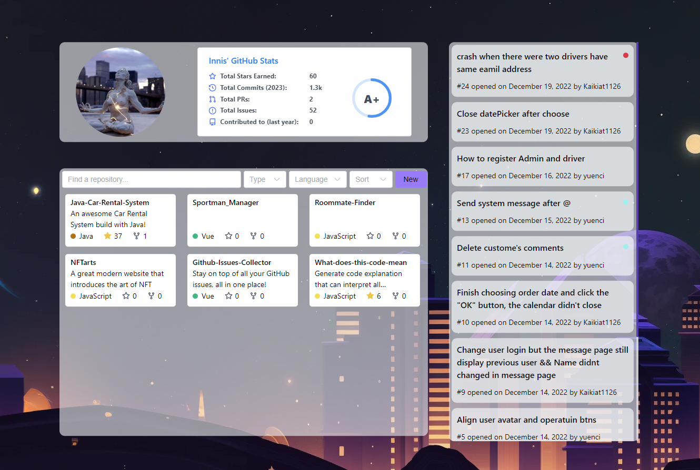
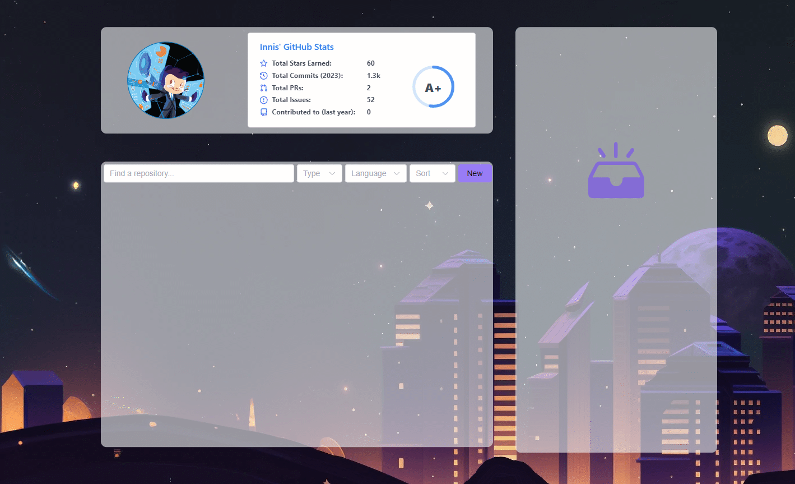
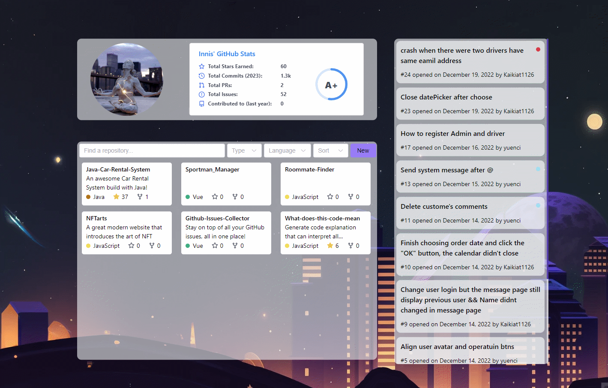
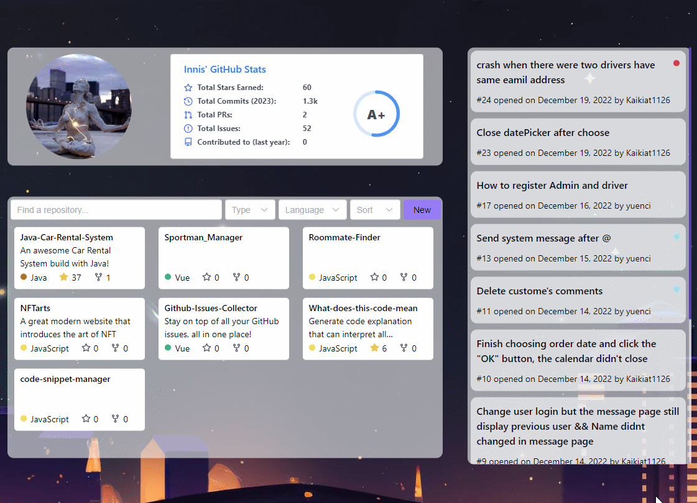

<a name="readme-top"></a>

# Github Issues Collector



I have a lot of projects in progress at the same time. Sometimes I want to know what issues are in the current projects. At this time, I had to open all the projects and look at them one by one. It is very inconvenient, so I wrote this application to put the The issues of the projects on Github can be viewed together, which is more convenient for me to manage all issues.

## 💻 Prerequisites

Before you begin, make sure that you have met the following requirements:

* You have installed the latest version of nodejs
* You have installed the latest version of Yarn

## 🚀 Installing

To install this project, follow these steps:

1. Clone repo

```bash
$ git clone https://github.com/yuenci/Github-Issues-Collector
```

2. Install dependencies

```bash
$ yarn
```

3. Start project

```bash
$ yarn dev
```

## ☕ Usecase

To use this project, follow these steps:

#### 1. Set token

   1.1 Go to https://github.com/settings/tokens?type=beta

   1.2 Set token's name and Repo's access
   

   1.3 Set issues permissions
   

   1.4 Generate token
   

   1.5 Input token
   

#### 2. Add repo and view issues



#### 3. Go to github for more operation


#### 4. Search and filter



## 📫 Contributing

To contribute this project, follow these steps:

1. Fork this repository.
2. Crie um branch: `git checkout -b <some_branch>`
3. Make your changes and confirm them: `git commit -m <message_commit>`
4. Push to the original branch: `git push origin <peoject_name> / <local>`
5. Create the pull request.

Alternatively, see the GitHub documentation on how to [create a pull request](https://help.github.com/en/github/collaborating-with-issues-and-pull-requests/creating-a-pull-request).

## 🤝 Collaborations

<a href="https://github.com/yuenci" target="_blank" >
  
</a>

Innis - yuenci1575270674@gmail.com

## 😄 Be one of the contributors

Want to be part of this project? Click HERE and read how to contribute.

## 📝 License

This project is under license. See the [LICENSE](./LICENSE) file for more details.

<p >(<a href="#readme-top">⬆ Back to top</a>)</p>
